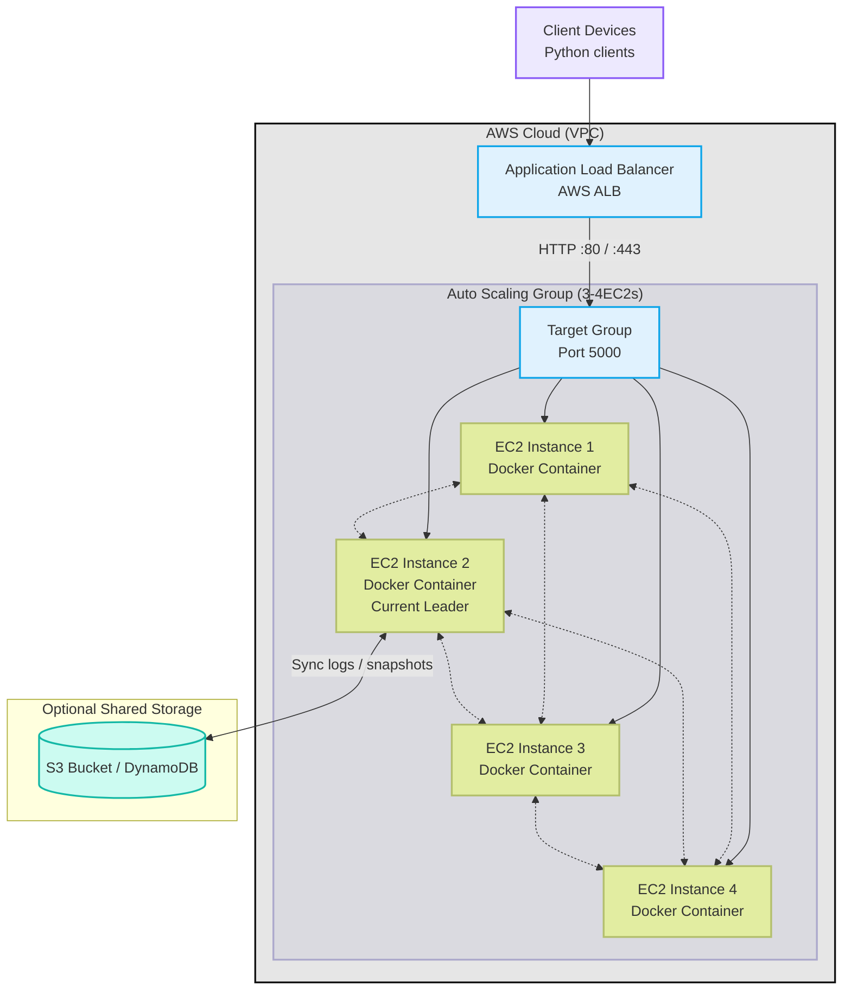

# D-Chat — Distributed Chat System (Starter)

**Team:** Nooa Saareks, Atte Högman, Joona Kettunen

This repository contains a starter implementation for the D-Chat project (Distributed Chat).
It uses Python 3.11+, asyncio for networking, and a simple Tkinter GUI client.

**Structure**
```
dchat/
├── README.md
├── aws_setup_guide.md
├── requirements.txt
├── server/
│   ├── main.py
│   ├── message_protocol.py
│   ├── node_manager.py
│   ├── state_manager.py
│   └── utils.py
└── client/
    ├── main.py
    ├── ui.py
    ├── message_handler.py
    └── utils.py
```

Quick start (local testing)
1. Create a virtualenv: `python3 -m venv venv && source venv/bin/activate`
2. Install requirements: `pip install -r requirements.txt`
3. Start coordinator server:
   `python3 server/main.py --mode coordinator --host 0.0.0.0 --port 9000 --config server/config_coordinator.json`
4. Start a worker server (different terminal or host):
   `python3 server/main.py --mode worker --host 0.0.0.0 --port 9001 --coordinator 127.0.0.1:9000 --peers 127.0.0.1:9002`
5. Start the GUI client:
   `python3 client/main.py --host 127.0.0.1 --port 9001 --user alice`

Local testing - alternative way:
1. Run `python3 server/test_server.py --host 127.0.0.1 --port 9001` in Terminal 1
2. Run `python3 client/main.py --host 127.0.0.1 --port 9001 --user alice` in Terminal 2
3. Run `python3 client/main.py --host 127.0.0.1 --port 9001 --user bob` in Terminal 3

See `aws_setup_guide.md` for EC2 deployment instructions and `server`/`client` code comments for details.

## System Architecture Diagram


